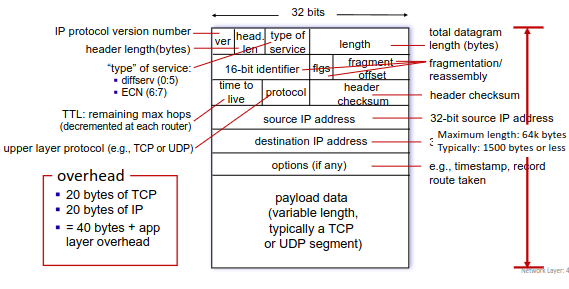
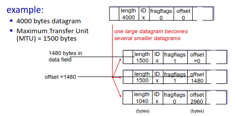
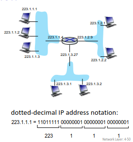
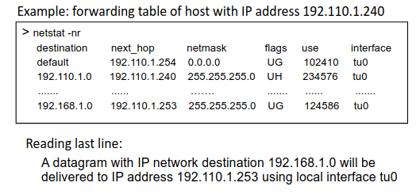
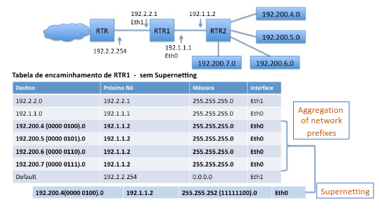
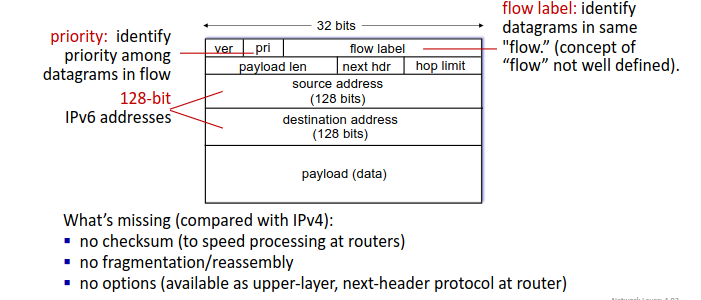

# Chapter 4 - Camada de rede
## ♟️ Network Layer
- Transporta segmentos do host que envia para o que recebe
- O sender faz o encapsulamento dos segmentos nos datagramas e envia-os
- O receiver entrega segmentos para a camada de transporte
- Existe protocolos da camada de rede em todos os dispositivos ligados à rede (host, router, etc.)
- Os routers examinam os cabeçalhos em todos os datagramas IP, que passam por ele

### Two key network-layer functions
__Forwarding:__ Move os pacotes da ligaç
ao de input para a ligação de output de um router

__Routing:__ Determina a rota que os pacotes vão tomar desde a origem até ao destino (utilizando algoritmos de routing)

## Tabelas de encaminhamento
Destination Address Range  | Link interface
-------------------------- | --------------
110010000001011100010....... | 0
110010000001011100011000.... | 1
110010000001011100011....... | 2
otherwise | 3

O IP vai usar o conceito de *longest prefix matching*. Ou seja, vai encontrar na tabela, o prefixo que mais se adequa e vai usar essa link interface.

❓ Wich interface is the next Destination Adress using? 

11001000 00010111 00010110 10100001
✔️ Link Interface: 0

11001000 00010111 00011000 10101010
✔️ Link Interface: 1 (também da match na 2, mas como na 1 é mais longo usamos a 1)

## ♟️ IP: The Internet Protocol
### ICMP - Internet Control Message Protocol
É utilizado por hosts e por routers para comunicar a nível da rede. Exemplo desta comunicação é __*error reporting*__ (unreachable host,etc.) e __*echo request/reply*__ (utilizado pelo ping)

As mensagens ICMP são encapsuladas no datagrama do IP, logo podemos concluir que o __ICMP opera numa camada de rede acima, relativamente ao IP__

O ICMP segue o seguinte formato

- __Tipo:__ Define o tipo de mensagem ICMP (por exemplo, 3 para destino inalcançável)
- __Código:__ Fornece informações adicionais sobre o tipo de mensagem (por exemplo, no caso anterior, indica se o destino inalcançável é uma rede, porta,etc)
- __Checksum:__ Utilizado para verificar a integridade da mensagem ICMP
- __Descrição:__ Contém informações sobre o erro ou a ocorrência (por exemplo cabeçalhos de pacotes ou detalhes do erro)

Existem dois tipos de ICMP's, o __ICMPv4__ (versão usada em IPv4) e o __ICMPv6__ (versão usada em IPv6)

### Traceroute
Neste comando, a origem envia uma serie de segmentos UPD (User Datagram Protocol, ou então ICMP com a flag -I) para o destino.

__Particularidades:__
- o TTL (Time To Live, está representado no Header do IP) começa em 1, e vai sendo incrementado
- usa-se o número de portas improváveis (para uma melhor identificação) 

Quando o n-ésimo set de datagramas chega ao n-ésimo router, o mesmo discarda os datagramas e envia, para a origem, uma mensagem ICMP (tipo 11, código 0), na qual inclui o nome do router e o seu IP. Posteriormente, quando esta mensagem chega ao destino, este vai guardar o RTTs

💡 RTTs (Round-Trip Times) => Tempo que levou para enviar o pacote e receber a resposta

__Critérios de Paragem:__

1. O segmento UPD chega ao host de destino
2. O destino retorna a mensagem ICMP *"port unreachable"* (tipo 3,código 3)
3. A origem para de enviar pacotes

## IP Datagram Format

__IP Fragmentation/Reassembly:__

Os network links têm um __MTU__ (max transfer unit/size), por isso se o IP datagram for mais largo que este valor, cria-se uma necessidade de fragmentação do datagrama do IP. Isto é, um datagrama origina vários, que serão identificados e ordenados através dos __IP Header Fields__(identifier,flags,fragment offset). 

💡 A junção destes datagramas (Reassembly) apenas acontece no destino!

💡 O último fragmento leva o restante do pacote original (daí serem 1040).
O datagrama original tem 4000 bytes, ou seja, o payload é 3980 bytes, devido ao cabeçalho IP ter 20 bytes!

### IP addressing
Router -> equipamento de interligação de nível 3

Switch -> equipamento de interligação de nível 2

❓ O que é um IP address?

✔️ É um identificador, de 32 bits, associado a cada host ou router interface

💡 Interface é a conexão entre host/router e a ligação fisica (Router's costumam ter masi do que uma interface, os hosts costumam ter 1 ou 2 interfaces, caso o mesmo tenha mais do que 2 IP addresses ativos é chamado de *multihomed*)

Este router possui 3 redes (representadas pelas àreas a azul) e 3 endereços de IP, cada uma associado à sua interface, sendo estes:

    -223.1.1
    -223.1.2
    -223.1.3

__Os endereços IP estão associados às interfaces__

Tal como visto na figura, o IP 223.1.1.1 origina uma sequência de 32 bits.
Nestes bits, existe uma parte que identifica a __rede__ (ou subrede) e outra que identifica a __interface do host__, nessa rede (costuma ser por esta ordem, mas o número de bits alocados para cada um pode alterar consoante a classe!)

### CIDR - Classless Internet Domain Routing
__Network Mask:__ É um *bit pattern* que define quais bits em um endereço IP correspondem à identificação da rede (atua como um filtro de rede!)

Normalmente costuma ser representado da seguinte forma:

    a.b.c.d/n -> n é a network mask

Classe A: máscara /8
Classe B: máscara/16
Classe C: máscara /24

Quando não usamos classes, a máscara pode tomar qualquer valor, permitindo assim, a criação de super-redes ou sub-redes

__Exemplo:__

Considere o IP __130.1.5.1__

Ao passar o IP para binário podemos concluir que o mesmo pertence à __classe B__, ou seja a __máscara é /16__ (ou 255.255.0.0) e podemos concluir que o IP corresponde à __*host interface* 5.1__ na __rede 130.1.0.0__

Se considerarmos o IP __130.1.5.1/24__, podemos concluir que:

- É o endereço da __*host interface* 1__ na __subrede 130.1.5.0__
-  O subnetting é definido no espaço host ID, ou seja, __\<Network ID>\<Subnet ID>\<Host ID>__

### Subnet
Uma sub-rede é um segmento de uma rede maior, onde os dispositivos podem comunicar diretamente uns com os outros, sem precisar da intervenção de um router. Para determinar as sub-redes, separamos a ligação ao router, criando redes isoladas. 

💡 Para ter comunicação entre sub-redes é obrigatório ter um router, com interface para a sua própria rede

|Vantagens|Desvantagens|
|:---:|:---|
|Permite uma melhor organização e gestão dos endereços |Reduz espaço de endereçamento (vários endereços passam a reservados)|
|Permite introduzir mais níveis hierárquicos para routing | Gestão mais trabalhosa|

__Endereços Reservados:__

- __Primeiros 4 bits__ não podem ser __'1'__
- __127.x.x.x é reservado para loopback__ (envio e receção de pacotes para o mesmo dispositivo)
- Bits do campo \<host> __todos a '0' ou todos a '1'__
- Bits de \<Network> / \<Subnet> (rede/sub-rede) __todos a '0' ou todos a '1'__

__Endereços Privados:__

Estes endereços são atribuídos a internets privadas (sem conectividade IP global, não devem ser visíveis, nem são encaminhados para na Internet)

    - Bloco 192.168.0.0/16 a 192.168.255.255/16
    - Bloco 172.16.0.0/12 a 172.31.255.255/12
    - Bloco 10.0.0.0/8 a 10.255.255.255/8

### Encaminhamento
Os routers e os hosts formam uma table de *IP forwarding*.
Esta tabela é interpretada da seguinte forma:

- __1ª Coluna__ -> Endereço da rede de destino (mais a máscara)
- __2ª Coluna__ -> Endereço de IP da interface de entrega (*next hop*)
- __3ª Coluna__ -> Netmask
- __Última Coluna__ -> Identificador da interface de saída da máquina local
- __Outras Colunas (opcionais)__ -> flags, tráfego na interface, custo... 

### SuperNetting
Para aplicar este conceito devemos tratar das redes diretamente ligadas, tráfego interno e rota por defeito. A rota por defeito tem de garating acesso à rede onde o router está ligado. No exemplo apresentado, é RT1. No caso das redes internas, só precisamos de saber quais são acessíveis via RT2 (especificamos isso através do IP de RT2).

💡 __Caminho por defeito__ é a rota a seguir caso não exista uma entrada específica na tabela para a rede destino. Este é um caso particular de routing estático

Tal como podemos observar na tabela, as conexões internas partilham o mesmo (próximo) salto, o que permite fazer agregação de rotas. Para este processo, é preciso __alterar a máscara__. Ao olhar para a parte em binário, é possível confirmar a existência de uma padrão (__0000 01__), logo podemos concluir que os últimos dois bits são irrelevantes para a forma de encaminhar. Ao abdicar deles, __não criamos nenhuma ambiguidade__, e ficamos apenas com uma entrada na tabela de encaminhamento. Esta entrada tem a máscara __255.255.252.0__. 

⚠️ É importante saber que os equipamentos nível 2 (bridges e switches) e,por isso, não são visíveis a nivel 3 (rede). Ou seja, quando defenirmos as redes IP's, estes dispositivos __não vão ser considerados__ (Não criam sub-redes)

### Routing Static vs Dynamic
|Static|Dynamic|
|:---:|:---|
|Rota estática são configuradas pelo administrador e são imutáveis | Rota dinâmica e atualizada ao logno do tempo|
|É um esquema bastante rígido, pouco flexível, mas simples e consegue reduzir o tráfego na rede| Os routers trocam informação de routing entre si. Implementam protocolos específicos (RIP,OSPF,BGP,etc). Tem uma grande flexibilidade e adapta-se de forma automática a falhas ou mudanças na configuração da rede. Porém,o tráfego da atualização pode causar sobrecarga na rede|
|

### Computação dinâmica das rotas
__Centralizada:__ Cada router, conhecendo a topologia da area, determina o melhor caminho para os possíveis destinos dessa rede

__Distribuída:__ Cada router, envia informação de encaminhamento que conhece aos router vizinhos (redes a que dá acesso)

## ♟️ NAT - Network Address Translation
__Motivação:__ A rede local usa apenas um endereço IP, no que diz respeito ao mundo externo

Todos os dispositivos numa rede local têm endereços de 32 bits num "IP Privado" que só pode ser usado na rede local

__Vantagens__
- Um endereço IP pode ser usado para todos os dispositivos
- É possível alterar endereços de dispositivos na rede local
- É possível alterar o ISP sem mudar os endereços dos dispositivos
- No quesito segurança, os dispositivos na rede local não são diretamente endereçados, logo não são visiveis externamente

### Implementação
Para implementar esta metodologia, o router NAT deve seguir, necessariamaente, os seguintes requisitos:

- __Datagramas de saída:__ substitui o __endereço IP da origem__ e o __número da porta__ de cada datagrama de saída para um __endereço IP NAT__ e um __novo número da porta__ 

- __Guardar__ registo do par de tradução (na tabela de tradução NAT), antes da substituição e após a mesma (IP origem + Nª Porta // IP NAT + Nª Porta novo)

- __Datagramas recebidos:__ substituir o endereço IP NAT, e o novo número da porta, de cada datagrama recebido para o endereço IP origem e número da porta (armazenado na tabela de tradução NAT)

⚠️ O NAT é controverso pois o router deve processar, apenas, até a camada 3 e viola o argumento de ponta a ponta (é necessário especial atenção por parte dos designers de aplicações). Outro problema é a falta de endereços (pode ser resolvido por IPv6)

## ♟️ IPv6 - Internet Protocol version 6
__Motivação:__ Tal como sabemos, o espaço de endereçamento que o IPv4 tem (32 bits) é limitado. Para isso, devemos expandir este espaço para 128 bits (IPv6). Para além de ser a solução para o esgotamento de endereços, este modelo permite um processamento/encaminhamento mais rápido (com um header de 40 bytes fixo) e também um tratamento diferente no nível de camada de rede para "fluxos".

### IPv6 Datagram Format

Tal como referido, o header tem um tamanho fixo de 40 bytes. Por defeito não existe fragmentação, tem prioridade relativamente aos outros datagramas (__traffic class__), identifica o fluxo de datagramas (__flow label__) e identifica o protocolo da camada superior (__next header__)

### Diferenças para o IPv4
- __Checksum:__ Removido inteiramente para reduzir o tempo de processamento em cada router
- __Fragmentation:__ Não existe fragmentação
- __Options:__ Não existe campo para options pois estas estão definidas no campo "Next Header"
- __ICMPv6:__ Novo formato de mensagem ICMP