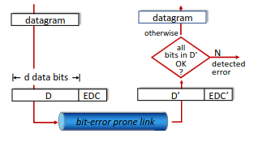
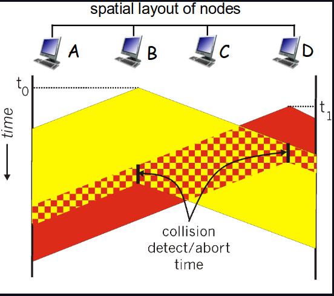

# Chapter 6 - Link Layer

## ♟️ Introduction

__Terminology:__

- Hosts / Routers: Nodes
- Canais de comunicação que conectam os nós adjacentes ao longo do caminho de comunicação: Links
  - Wired links;
  - Wireless links;
  - LANs;
- Pacote de nivel 2 de camada: Frame (encapsula o datagrama)

💡 A responsabilidade do Link Layer é transferir datagramas de um nodo para outro, que seja fisicamente adjacente (é diferente do nível do IP)

__Analogy__

- Viagem de Guimarães para Rio de Janeiro
  - carro: Guimarães para Aeroporto Porto
  - avião: Aeroporto Porto para o Aeroporto de São Paulo
  - comboio: São Paulo para Rio de Janeiro

Neste caso, nós somos o __datagrama__, o segmento dos transportes corresponde ao __communication link__ , o modo de transporte é o __link-layer protocol__ e, por fim, a agência de viagens é o __routing algorithm__.

__Framing:__ Encapsular o que o nível 3 para uma unidade de dados de nível 2 (frame)

⚠️ Endereços MAC são endereços físico! Ao contrário dos IPs, estes identificam destino e origem (no header).

__Flow Control:__ Serviço genério que pode existir no nível 2. Regula a candência entre nós adjacentes (um que envia e um que recebe).

__Error Control:__ Existem 2 tarefas (deteção e correção). É possível receber uma entrega não fiável e simplesmente descartar. Códigos de correção são muito pouco usados porque possuem *overhead* muito grande. Utilizam-se códigos de retransmissão! Redes cabeladas têm muito poucos erros e é __possível que nem tenham código de deteção de erros__. Redes WiFi, como o meio é muito mais suscetível a erros, o __código de deteção de erros está sempre presente__.

__Half-Duplex e Full-Duplex:__ Half são bidirecionais alternadas (uma de cada) e Full é em simultâneo!

### Error Detection

Deteção de erros é feita através de um código de deteção de erros. O emissor adiciona bits de deteção de erros ao frame. O receptor recebe o frame e verifica se os bits de deteção de erros estão corretos. Se não estiverem, o frame é descartado.

EDC = Error Detection and Correction bits (redundant bits) = Datos protegidos por error checking, podem incluor header fields

Tem noção que o error detection não é 100% fiável! Estes protocolos podem não detetar erros, mas é raro. Longos EDC são mais fiáveis que curtos.

## Multiple Access Protocols

Existem dois tipos de links

- Point-to-point:
  - PPP para dial-up;
  - PPP link entre Ethernet switch e host;
- Broadcast (shared wire or medium)
  - old-school Ethernet;
  - upstream HFC (Hybrid Fiber Coax);
  - 802.11 wireless LAN;

O último ponto, é o único canal compartilhado de broadcast.
Duas ou mais transmissões simultâneas por nodos = interferência.
Irá decorrer colisão se dois ou mais nodos transmitirem ao mesmo tempo!

__Multiple Access Protocol:__ É um algoritmo que determina como os nodos compartilham o canal. A comunicação sobre este compartilhamento tem de ser realizada no próprio canal!

__Ideal Multiple Access Protocol__

Seja um MAC (multiple access channel) com taxa de R bps

1. Quando um nó deseja transmitir, o mesmo pode enviar na taxa R
2. Quando M nodos querem transmitir, cada um pode enviar na taxa R/M
3. Totalmente descentralizado:
    - nenhum nó especial para coordenar as transmissões
    - sem sincronização de relógios, slots ...
4. Simples

## MAC Protocols

O maior desafio é quando há um meio de difusão: um meio partilhado em que qualquer estação pode aceder ao meio e uma vez acendendo ao meio, todas as outras têm a possibilidade de ouvir e receber a trama que está a ser transmitida.

__Colisão:__ Acontece quando um nodo recebe 2 ou mais sinais ao mesmo tempo. As tramas vão ser recebidas com erro! Para regulamentar este acesso, utilizam-se *protocolos de acesso múltiplo*. Uma regra base, é que este controlo seja feito usando o próprio canal de comunicação (__Inbad Channel__).

__Taxonomia:__ Esquema de classificação de protocolos. Existem 3 classes genéricas:

- Channel Partition: canal é dividido em pequenas unidades. Os protocolos alocam pequenos traços de capacidade da ligação para uso exclusivo de um determinado modo.
- Random Access: Canal não é dividido, logo há possibilidade de ocorrerem colisões. (vai haver uma forma de recuperar essas colisões)
- Taking Turns: Passagem de *tokens* entre nodos.

### Channel Partition

__TDMA:__ Método livre de contenção. A capacidade do canal é, numa primeira instância, __dividida em *time frames*__, sendo cada um destes __dividido em slots__. O acesso vai sendo feito dentro de cada time frame. Cada estação é fixada a um time slot, que normalmente corresponde ao tempo de transmissão de pacote. Slots que não sejam usados por estações __não são reusados por outras estações!! Vão para um estado de *idle*__

__FDMA:__ Método no qual o canal é dividido em múltiplas frequências e a cada estação é atribuída uma frequência.

Esta escolha vai depender do conteto da aplicação e das condições da rede.

|TDMA|FDMA|
|:--:|:--:|
|Existem requisitos estritos para latência e atraso| Simplicidade e flexibilidade são mais importantes|
|O canal é suscetível a interferências|Há um grande número de usuários que precisam de ser suportados|

### Random Access Protocols

Quando uma estação acede ao meio, pode utilizar toda a capacidade existente para transmitir. Foca-se em detetar/evitar colisões e como recuperar as mesmas.

__Slotted ALOHA__

O tempo é dividido em slots de tempo. Cada slot corresponde ao tempo de transmissão de um pacote. Quando uma estação tem um pacote para     transmitir, se não houver colisões, a estação pode enviar o pacote no próximo slot. Se houver colisões, a estação retransmite o pacote no próximo slot com probabilidade *p*, onde *p* é escolhido de forma a maximizar a eficiência do canal.

__Pure ALOHA__

Não considera slots, logo não tem sincronização. A probabilidade de colisões aumenta uma vez que a trama enviada em t0 pode colidir com a trama enviada em t0 -1 e t0 +1. Eficiência do canal ronda os 18%.

__CSMA (Carrier Sense Multiple Access)__

Neste método, escuta-se o meio antes de começar a trasmitir (Analogia Humana-> Se alguém está a falar, não vou interromper). Podem ocorrer colisões devido ao *delay*. Um nodo B pode começar a transmitir e um nodo D pode fazer o mesmo, visto que ainda não ouviu B. Há uma interferência do sinal vermelho com o sinal amarelo que corrompe a trama!

__CSMA/CD (Colision Detection)__

Num meio partilhado, a cabo, é possível detetar colisões porque a rede que está a transmitir faz simultaneamente a análise ao meio e apercebe-se que o sinal que está a colocar no meio deixa de ser igual aquele que está a transmitir. Logo, em redes cabelas, a colisão é detetada facilmente. Por outro lado, em rede WiFi não é tão fácil (fenómenos como *fading* e *redes escondidas*). Para tal, é usado o __CSMA/CA__. Em meios cabelados quando uma colisão é detetada, as estações reforçam a colisão (geram um ruído para a linha) e abortam a colisão (seguido de um *backoff*).

### Taking turns

__Polling:__ O nodo "controlador" convida os outros nodos a transmitir (à vez).
Problemas: Polling Overhead / Latência / Single Point of Failure (controlador)

__Token Passing:__ Um token circula pela rede e só a estação que detém o mesmo é que consegue transmitir.
Problemas: Token Overhead / Latência / Single Point of Failure (token)

## LANs

### Endereços MAC e ARP

Endereços únicos na rede local. Isto é, só podemos ter acesso a estes se forem adjacentes à nossa rede local.

Endereço IP -> Muda de acordo com a rede "hospedeira"

Endereço MAC -> Não muda. (Associado ao Hardware)

Protocolo ARP -> Permite saber o endereço MAC através do seu IP

Se A quer enviar uma trama para B, mas o endereço MAC do B não está na tabela
ARP do A, A tem de fazer um ARP request, que contém o endereço IP de B. O endereço
MAC destino utilizado é o endereço de broadcast layer-2 (ff-ff-ff-ff-ff-ff). Quando uma
trama possui esse endereço, TODOS os sistemas nessa LAN vão processar essa trama.
Vão desencapsular, processar o pacote IP, e ver se o seu IP é igual ao IP pedido. A
máquina com o IP correspondente, vai responder a A com uma primitiva “ARP reply”
com o seu endereço MAC. E nessa altura o A pode atualizar a sua tabela ARP com a
informação recebida.

### Ethernet

A tecnlogia LAN com fio "dominante". Foi a primeira tecnologia LAN amplamente utilizada pois era simples e barata. Funciona com um único chip e tem várias velocidades (Também acompanhou a corrida da velocidade -> 10 Mbps to 400 Gbps).

__Bus:__ Todos os nodos no mesmo dominío de colisão. Ou seja, podem coliir uns com os outros. 

💡 Bastante popular nos anos 90!

__Switched:__ Todos os nós estão ligados a um switch (layer 2 de rede). Não há colisões!

💡 Usado atualmente!

__Unreliable / Connectionless__

*Connectionless* ->  Em uma comunicação connectionless, não há um processo de handshaking (aperto de mão) entre o remetente e o destinatário antes de começar a enviar dados

*Unreliable* -> o dispositivo receptor não envia confirmações (ACKs - Acknowledgements) de recebimento ou notificações de não recebimento (NAKs - Negative Acknowledgements) de pacotes ao dispositivo remetente. Isso significa que o remetente não tem como saber se os dados foram recebidos corretamente ou se foram perdidos no caminho. Se algo corre mal, as NIC descartam a trama e depois tentam recuperar de colisão.

### Switches
É um equipamento de nível 2. O switch é capaz de paralelismo (store and forwarding das frames). Em situaçoes de colisão, duas tramas a chegar ao switch por portas diferentes destinadas a mesma porta, primeiro comuta uma e depois comuta a outra. Examina o MAC Address da trama que esta a chegar e seletivamente encaminha essa trama por uma ou mais portas de saída. É transparente, isto É, os hosts não sabem da presença de switches. Tem a capacidade de aprendizagem, não precisa de muita configuraçao (apenas a mais básica). Permite isolar qualquer transmissoes simultâneas sem colisões.

__Switches Interconectados__

Os switches podem estar conectados devido à sua capacidade de *self-learning*.

__Switches VS Routers__
Em ambos os casos, eles são armazenados e encaminhados. Os roteadores funcionam com um dispositivo de camada de rede, enquanto os switches funcionam com dispositivos de camada de link. Outra coisa que eles têm em comum é que ambos possuem tabelas de encaminhamento. Enquanto os routers calculam as tabelas usando algoritmos de roteamento (endereços IP), os switches aprendem como preencher sua tabela de encaminhamento usando flooding, learning e endereços MAC.

### VLANs
Um (ou mais) switch a suportar a capacidade da VLAN pode ser configurado para suportar mais do que uma VLANs numa única LAN
