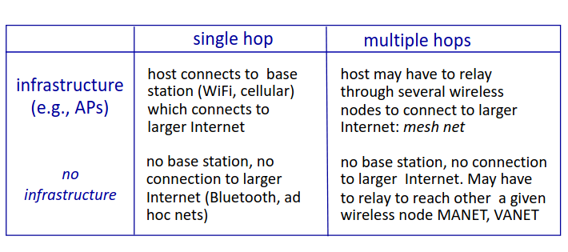
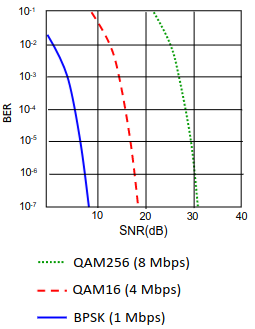
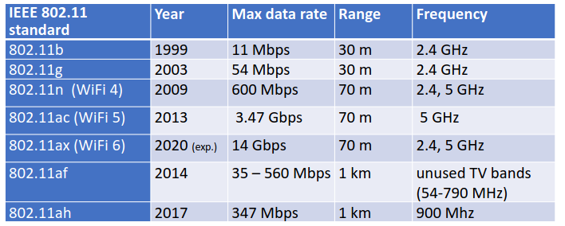
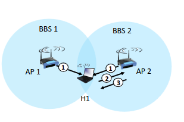
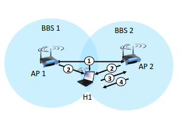
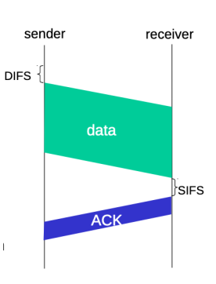
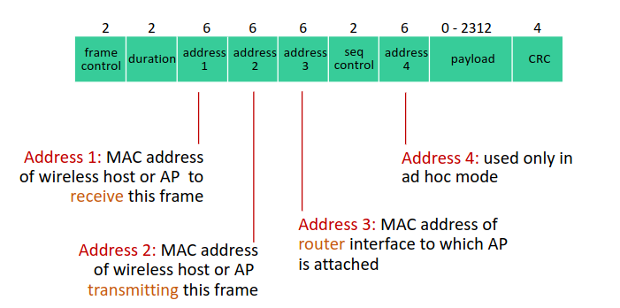

# Chapter 7 - Wireless
## Wireless
### Caracteristicas das redes Wireless
Tem um modo __infraestruturado__, isto é, tem uma ligação com a infraestrutura. Há a possibilidade de entre áreas.
Também pode funcionar em modo __ad hoc__, ou seja, os nós só podem comunicar se estiverem dentro da área de cobertura.

Os sinais, devido ao contacto com o ar e com possíveis obstáculos, são significamente atenuados (há um decréscimo da força do sinal - este fenómeno não acontece em sinais cabelados). Logo, podemos concluir que este método é o mais suscetível a sofrer interferências.

💡 A banda 2.4 GHz é uma banda onde funcionam muitos dispositivos, havendo uma grande interferência

__Multipath Propagation:__ O sinal de rádio é refletido em paredes, obstáculos, etc, chegando ao destino com pequenos desfaçamentos.

__SNR__ -> Relação Sinal Ruído. Quanto mais forte for o sinal, mais fácil será remover o ruído, ficando assim com o sinal limpo

__BER__ -> Significa Bit Error Ratio, e representa os bits errados face aos bits transmitidos. O objetivo é que seja o mais baixo possível.

É possível diminuir o BER se se aumentar a potência dosinal. Mas também, é possível reduzir o débito (banda) para obter o mesmo resultado

### Problemas
__Terminal Escondido__

A escuta o B, o B escuto o C, mas o A não escuta o C. Portanto, A e C podem transmitir ao mesmo tempo, causando interferência em B.

### IEEE 802.11 wireless LANs (WiFi)

Todas usam __CSMA/CA__ para acesso múltiplo! É um método de controlo de acesso específico de redes WiFi

- Base Station -> Access Point (AP);
- Basic Service Set (BSS) -> Àrea de cobertura que está a ser servida por um AP, em particular.

💡 Para um host operar, este deve estar associado ao AP. Faz *scannin* dos vários canais ou então pode ir recebendo *beacon frames* que são enviadas pelos AP que informam sobre o nome de AP (SSID) e o MAC Address. O host, após receção destes beacons, seleciona o AP a qual se quer associar.

__Scanning Passivo:__ Feito quando o host H1 toma conhecimento das características da BSS através de *beacons*. Estes são enviados do AP para as STA's. Com base nesses beacons, a estação H1 escolhe qual o AP a que se vai associar

__Scanning Ativo:__ O host H1 envia um *probe request* em broadcast e os AP's que estão nas imediações respondem (probe response).

__Multiple Access__
CSMA escuta o meio antes de transmitir. Há situações em que a colisão não é detetada de forma eficaz!
Num meio wireless, não é possível ter a garantia da qualidade do sinal que a estação recetora está a ter, uma vez que podem receber sinais muitos fracos. Portanto, o que o 802.11 decidiu foi que não iam fazer deteção de colisão mas sim __evitar colisões (CSMA/C(collision)A(avoidance))__!

__802.11 sender:__ Há um tempo inicial que o sender tem de esperar antes de começar a transmitir (costuma ser 28-50 microsegundos - DIFS). Depois deste compasso de espera, transmite a trama integralmente sem fazer deteção de colisão. Se o meio estiver ocupado, a estação não fica, de um forma persistente, a tentar enviar o sinal. Começa o "random backoff time" e o timer conta enquanto o canal está inativo. Se não recebeu o ACK, aumenta o "backoff time" e volta a entrar em ciclo de espera

__802.11 receiver:__ Espera entre 10 a 16 microsegundos (SIFS) e se a trama for recebida, envia um ACK. Se este ACK não chega, é porque houve um erro!

Apesar de haver tempos de espera, pode de facto ocorrer colisões (devido ao nó
escondido, por exemplo). Portanto, antes de enviar dataframes, usar tramas de mais
curta duração que fazem um pedido de acesso ao meio. A STA (station), antes de
começar a enviar uma trama longa, usa pequenas tramas que pedem o acesso ao meio
(RTS – request to send). Não remove totalmente as colisões porque podemos ter
colisões a nível dos RTS, mas uma vez que uma STA ganha acesso ao meio, não existem
mais colisões. Depois da estação enviar o RTS, o AP faz um broadcast do CTS (clear to
send). O CTS é enviado a todos os nós.
Este método (RTS/CTS) permite reservar o canal, e é bastante importante no
sentido de remover na totalidade a colisão entre tramas porque uma vez que uma STA
ganha acesso ao meio, durante esse periodo tem o meio reservado só para ela.

__A probabilidade de haver colisões entre RTS é muito baixa. Caso ocorra,
acontece CSMA/CA. (backoff durante algum tempo e voltam a enviar o sinal).__

__Frame__

__Tipos de frames__

*Management frames*: Usado para executar funções de supervisão tais como entrar e sair de redes sem fio e mover associações de AP para AP

*Control frames*: usado em conjunto como data frames para executar operações de controlo tais como adquirir um canal, funções de manutenção de detenção de portador e confirmação de receção de dados.

💡 Permitem entregar dados de forma confiável de STA em STA

*Data frames*: usados para enviar dados de STA em STA. Vários data frames podem ocorrer, dependendo da rede!

__Power Managment:__ 

NODE-TO-AP
1. O nó informa o AP sobre o estado de suspensão: O nó móvel envia uma mensagem ao AP indicando que ele vai entrar em modo de suspensão até o próximo quadro de beacon
2. AP cessa a transmissão para o nó: Ao receber esta mensagem, o AP sabe que não deve enviar quadros (frames) para este nó enquanto ele estiver em modo de suspensão. Isso evita o desperdício de recursos e garante que as mensagens não sejam perdidas enquanto o nó está "sleeping".

BEACON FRAME
1. Lista de quadros pendentes: O quadro de beacon transmitido pelo AP contém uma lista dos dispositivos móveis que têm quadros (dados) pendentes esperando para serem enviados. Esta lista permite que cada nó móvel saiba se há dados esperando por ele no AP.
2. Nó acorda antes do próximo beacon: O nó móvel acorda pouco antes do próximo quadro de beacon ser enviado para verificar a lista. (se houver um dado com o seu ID, este permanece acordado, se não exisitir, volta a dormir)