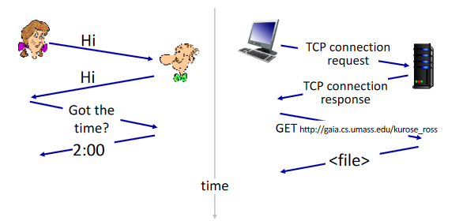
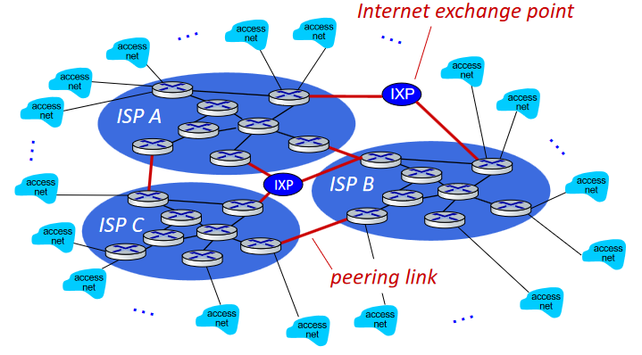

## ♟️ O que é a internet?

A internet é constituída por:

-> Host ou End System que pode ser um telemóvel, computador, ou qualquer dispositivo ligado à rede

-> __Packet Switches__ (Routers e Switches): Encaminham pacotes (chunks of data) que os utilizadores geram através da interação com a rede

-> __Communication links__ (ligações): Fibra ótica, cobre, rádio

-> __Networks__ (rede): Representa o conjunto de dispositivos, routers/switches e ligações (referidos nos pontos anteriores), que são gerenciados por uma organização (operadora)

Importante não esquecer que a taxa de transmissão é equivalente a largura de banda (capacidade máxima de transmissão de dados [bits] através de um canal de comunicação em um determinado período de tempo)

__Definição de Internet__ -> É uma "network of networks", i.e interconecta vários tipos de redes (sejam estas redes móveis, domésticas, ISPs [internet service providers] locais/globais,etc.) A internet serve como infraestrutura que provide serviços a aplicações (email, social media,etc.) e também como interface de programação para aplicações distribuídas (serve como "hook" para que sending/receiving apps se conectem utilizando a mesma como um serviço de transporte).

### ◻️ Protocolos
Protocolos Humanos

- "Qual é o tempo?"
- "Tenho uma questão."
- "Olá, sou o Henrique."

Protocolos de Rede

- Ao invés de humanos, agora são dispositivos (computadores)
- Todas as comunicações são "controladas" por protocolos

__Definição de Protocolo__ -> Conjunto de regras que são impostas na comunicação. De uma forma geral, definem o formato, ordem de mensagens que são recebidas e enviadas entre "network entities" e quais ações devem ser tomadas após receber/enviar as mensagens

__Exemplo de um protocolo humano e de rede:__

## ♟️ Network edge

### ◻️ Estrutura da Internet

__Edge:__ Composta por *hosts* (clientes e servidores) [muitas das vezes estes servidores estão em data centers]

__Access Networks:__ Nomeadamente redes por cabo e wireless

__Core:__ Equipamento de interligação que assegura o tráfego (consistem em routers interligados - "network of networks")

❓ How to connect end systems to edge router?

✔️ Using residential access nets, institutional access networks, etc.

__Frequency Division Mutiplexing:__ Diferentes canais a transmitirem em frequências diferentes (ex: um canal pode estar a transmitir vídeo e outro áudio)

### ◻️ Acess Networks
__Cable-based access__: Rede de cabos, ou fibra que conecta casas até a um ISP router (casas compartilham a rede de acesso à *headend* do cabo). 
HFC (hybrid fiber coax) origina *downstreams* e *upstreams* (trasmition rates) diferentes (40 Mbps - 1.2 Gbps, 30 Mbps - 100 Mbps [respetivamente]), logo é chamado de assimétrico.

__Digital subscriber line (DSL):__ Recorre à linha telefónica existente para efetuar a conexão até ao DSLAM (DSL access multiplexer). Os dados vão para a internet, e a voz vai para o telefone. A transmition rate é bastante inferior comparada ao paradigma anterior

__Home Networks:__ Todos os dispositivos estão conectados a um access point (caso WiFi) ou a um router (se for WiFi, o AP está ligado a este) que por sua vez está ligado a um cabo (ou DSL modem) que estabelece ligação com o ISP.

### ◻️ Hosts

Os hosts têm como função, de uma forma sucinta, enviar dados. Geralmente, a mensagem não é enviados de uma vez, esta é dividida em "bocados" menores (*packets*) com *L* bits. Por sua vez, estes *packets* são enviados através de um *transmition rate* R.
O PTD (packet transmission delay) pode ser calculado a partir da seguinte fórmula:

$$
\begin{align}
    \frac{L (bits)}{R (bits/sec)} = PTD
\end{align}
$$

💡 A utilização desta metologia (dividir a mensagem) é algo benéfico pois se existir um erro no envio de um dos *packets*, não será necessário voltar a enviar a mensagem na sua totalidade, apenas o *packet* cujo o envio não teve sucesso

### ◻️ Links (physical media)
Existem dois tipos de meios físicos: guiados e não guiados.

- __Guiados:__ O sinal propaga-se através de material físico. Temos como exemplo, cabo coaxial e fibra ótica (esta é imune a ruído eletromagnético e uma taxa de erro e de atenuação inferior, é melhor mas é mais cara 💵)

- __Não Guiados:__ O sinal propaga-se através da atmosfera, e por várias bandas do espectro eletromagnético (e.g sinais de rádio). Este tipo de propagação pode originar vários problemas devido a refleção do sinal, obstrução por objetos , interferência, ruído, etc.

## ♟️ Network Core
### ◻️ O que é o network core?
O network core (core da rede) nada mais é do que uma malha de equipamentos (routers/ switches) interconectados. Estes, por sua vez, recebem os pacotes fragmentos no host do utilizador e reencaminham-nos entre si até que o sinal chegue (na sua totalidade) a um destino final (servido). Estes pacotes são transmitidos à capacidade máxima da ligação

__Packet-switching:__ Existe um PTD (packet transmission delay) que demora L/R segundos a ser transmitir um pacote de L bits a um rate de R bps. Recorre ao princípio *store and forward*, que consiste em que o pacote inteiro deve ter recebido pelo router, para exisitir a transmissão para a próxima conexão (i.e o próximo router/switch)

__Queueing:__ Se o débito de entrada (em bps) for maior que o débito de saída (também em bps), os pacotes irão entrar numa queue (fila de espera), onde vão permanecer até serem transmitidos para o próximo link. Caso o buffer de memória encher, acontecerá o fenómeno de *packet drop*.

__Forwarding:__ Para isto ocorrer, o routing deve acontecer (routing é a determinação de como um pacote é encaminhado na rede). Só depois de todos os router saberem como encaminhar o tráfego, é que será possível o pacote chegar ao seu destino.

### ◻️ Packet ou Circuit switching?
Antes de enviar dados, é necessário estabelecer um circuito. Se quisermos um circuito com início em A e destino em B de 1 Gbps, é necessário alocar a capacidade de 1Gbps nos dois equipamentos.

O packet, permite ter mais utilizadores na rede. Circuit permite um melhor desempenho pois há uma alocação de recursos

### ◻️ Como é que dois hots enviam pacotes um para o outro, em qualquer lado?
Os hosts conectam-se à rede através de ISPs (Internet Service Providers). Por sua vez, estes ISPs devem estar conectados entre si (mesmo sendo de companhias diferentes, que competem entre si) através de IXP (Internet exchange point). Este processo de encaminhamento é algo muito complexo e dinâmico (esta evolução foi motivada por politicas económicas e nacionais,etc.)

## ♟️ Protocol Layers
Cada camada permite a cooperação entre entidades do mesmo nível protocolar que comunicam entre si, o que cria um contexto comum. *Comunicação por niveis ou camadas*:

 1. Conjunto de regras que reagem a comunicação entre intervenientes;
 2. Uma entidade é uma abstração de um ou mais processis computacionais;
 3. As regras são implementadas pelas entidades de uma camada protocolar;
 4. As funções protocolares são variadas e têm âmbitos ou contextos distintos;

*Exemplos de funções protocolares* : (Geração de sinais, definição de interfaces, sincronização, endereçamento, detenção/correção de erros, etc.). O modelo protocolar TCP/IP tem 4 camadas funcionais: aplicação, transporte em rede, ligação, (fisico). Para passar info da camada da aplicação para o transporte, há um encapsulamento dos dados da aplicação dentro de uma estrutura que tem um header próprio.